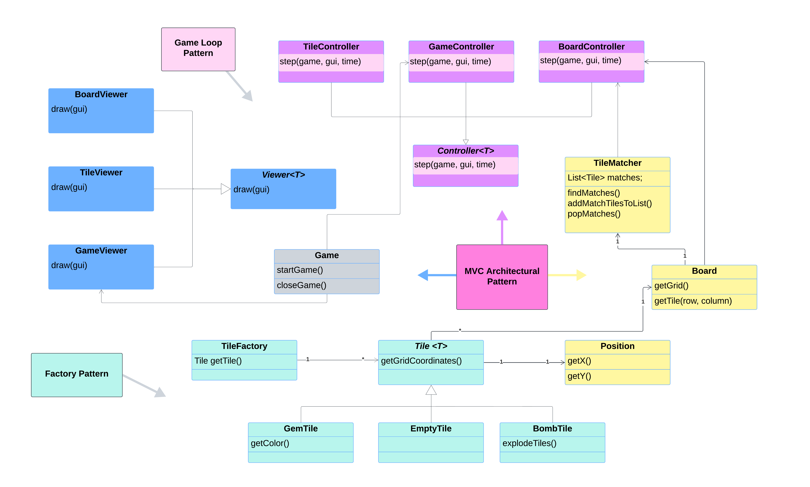
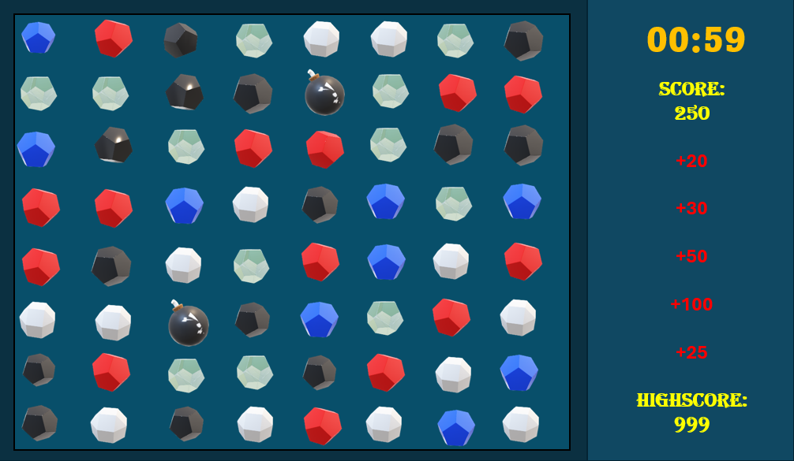
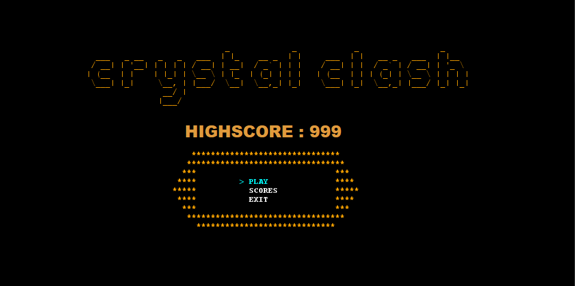

# CRYSTAL CLASH

Crystal Clash is a fast-paced puzzle game where strategy meets speed! Match three or more gems by swapping tiles, creating dazzling combos, and racing against the clock to outsmart the game.

This project was developed by **Ana Margarida Ribeiro** ([up202305264@fe.up.pt](mailto:up202305264@fe.up.pt)), **André Siqueira** ([up202300449@fe.up.pt](mailto:up202300449@fe.up.pt)) and **Henrique Perry** ([up202306582@fe.up.pt](mailto:up202306582@fe.up.pt)) as part of the **Software Design and Testing Laboratory** curricular unit.

## 🚀 Features

- [x] **Randomized board** - Each game begins with a unique, randomized arrangement of tiles, ensuring a fresh and unpredictable experience every time you play.
- [x] **Seamless tile movement** - Navigate effortlessly across the board in all directions using intuitive controls, while staying within the board's boundaries.
- [x] **Swapping tiles** - Swap adjacent tiles to create combinations
- [x] **Match detection** - Logic that automatically identifies matches of three or more tiles 
- [x] **Popping tiles** - Identified matches pop off the board to make space for new tiles
- [x] **Gravity-powered tile shifting** - Tiles cascade downward to fill empty spaces
- [ ] **Time-based gameplay** - Introduce a timer to add a sense of urgency, challenging players to score within a set time limit.
- [ ] **Dynamic scoring system** - Reward players for creating larger matches and performing combo moves, with bonus points for speed and precision.
- [ ] **Leaderboard** - Implement a leaderboard that tracks the best scores of all players
- [ ] **Bombs** - Introduce bombs as a special tile that can be used strategically to clear a section of the board. When matched, bombs could remove surrounding tiles.

## 🛠️ Technologies Used

- **Java:** Core programming language for game logic and mechanics.
- **Lanterna:** Lightweight library for creating terminal-based games. 
- **JUnit:** For unit testing to ensure code reliability and functionality.

## 🎮 How to play

Use the arrow keys to navigate between tiles. Press `SPACE` to select a tile, then an arrow key to choose the swap direction.

The main goal is to achieve the highest score possible within a limited time by matching tiles of the same color.

## 🧩 Design

### 🔧 Model-View-Controller Architecture

* **Why MVC?** Match-three puzzle games often involve complex mechanics like power-ups, animations, and custom rules. To simplify adding new features and ensure maintainability, we chose the Model-View-Controller (MVC) architecture. Its modular structure enhances clarity and makes the project more scalable.

* **What is MVC?** The Model-View-Controller pattern is a design approach that organizes the application into three distinct components: the model (manages the core data), the controller (acts as an intermediary for both the model and the view) and the view (handles the visual representation of the game).

* **How We Applied MVC:** As for the model, it includes the game’s mechanics, such as detecting matches, managing tile movements, and handling board state changes. As for the controller, it manages user interactions, like selecting and swapping tiles, and triggers updates to the model and view based on user actions. And as for the view, it ensures the game is visually represented by reflecting changes in the model and keeping the user engaged with a responsive interface.

### 🔧 Factory Design Pattern

* **Why Factory?**
In a match-three puzzle game, different tile types (e.g., gems, bombs, empty tiles) may have unique behaviors, properties, and visuals. Managing the creation of these tiles directly within the game logic would lead to repetitive code and make future changes inconvenient. The Factory Design Pattern allows us to centralize and simplify the creation of tile objects while adhering to the *Single Responsibility Principle*.

* **What is Factory?**
The Factory pattern is a creational design pattern that provides an interface or method to instantiate objects based on specified criteria without exposing the instantiation logic. This helps in producing objects while keeping the creation logic modular and maintainable.

* **How We Applied Factory:** Although the Factory pattern is not yet implemented, we plan to introduce it in the Tile class. Currently, tiles are created directly during the initialization of the game board. By applying the Factory pattern, we aim to facilitate the addition of new tile types in the future with minimal changes to the existing code and enhance code readability and maintainability by separating the instantiation logic from the game mechanics.

### Game Loop Pattern

* **Why Game Loop?** In games, actions like rendering visuals, processing player input, and updating the game state need to happen repeatedly and consistently to maintain a smooth and interactive experience. The Game Loop pattern allows us to manage these tasks in a structured way, ensuring the game progresses frame by frame while maintaining a steady rhythm regardless of input frequency or system performance.

* **What is Game Loop?** Game Loop is a design pattern that provides the structure for a game's main cycle. It repeatedly performs three main steps: processing input, updating game state and rendering.

* **How we Applied Game Loop:** In our project, the Game Loop manages the game's flow by continuously checking for player input, updating the game's internal state based on user actions (such as moving from the current tile or swapping tiles), and then rendering the board and its tiles.

## 🕹️ Demos 

**Note:** The current images are intended to demonstrate the vision and goals for the game’s final look and feel, and may not fully represent the current state of development

 - **Game preview**

- **Menu preview**

