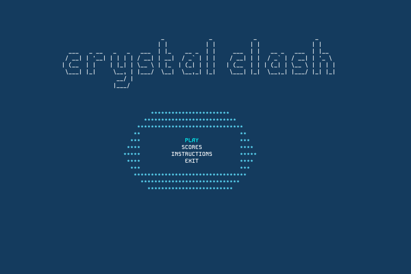
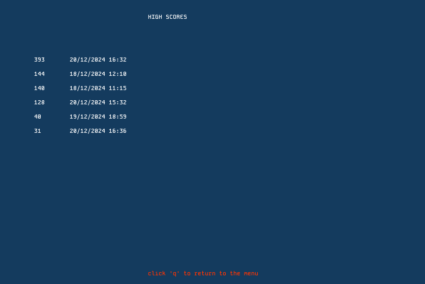
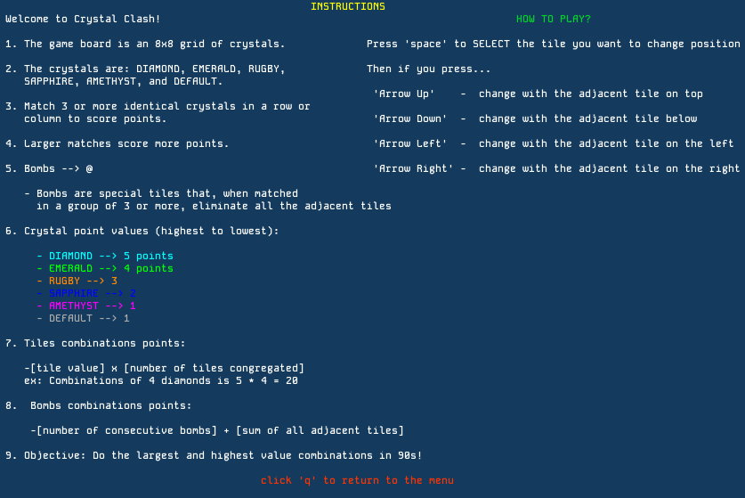
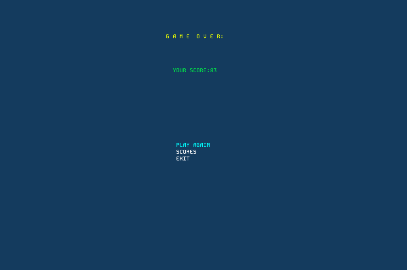
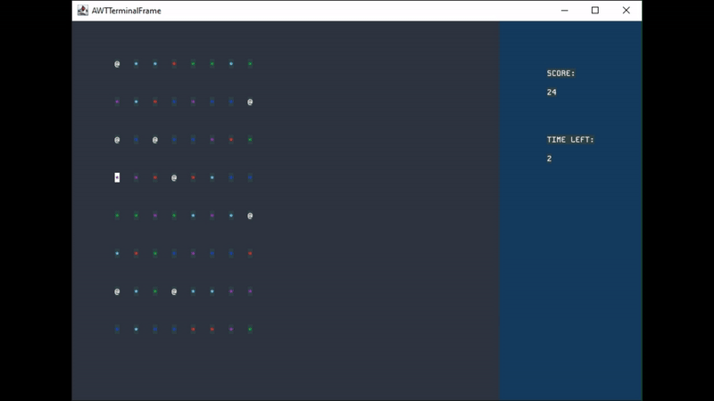

# CRYSTAL CLASH

Crystal Clash is a captivating puzzle game where every swap matters! Immerse yourself in fast-paced gameplay as you strategically match gems to make dazzling combos. Race against the clock and test your skills to achieve the highest score possible in this exhilarating challenge!

This project was developed by **Ana Margarida Ribeiro** ([up202305264@fe.up.pt](mailto:up202305264@fe.up.pt)), **André Siqueira** ([up202300449@fe.up.pt](mailto:up202300449@fe.up.pt)) and **Henrique Perry** ([up202306582@fe.up.pt](mailto:up202306582@fe.up.pt)) as part of the **Software Design and Testing Laboratory** curricular unit at **Faculty of Engineering of University of Porto**.

For a technical report of this project, click [here](./docs/README.md).

## 🎮 How to play

Use the arrow keys to navigate between tiles. Press `SPACE` to select a tile, then an arrow key to choose the swap direction.

The main goal is to achieve the highest score possible within a limited time by matching tiles of the same color.

## 🕹️ Screenshots

The following screenshots illustrate the general look of our game, as well as the divergent functionalities:

### Game preview

### Menus

### End game

