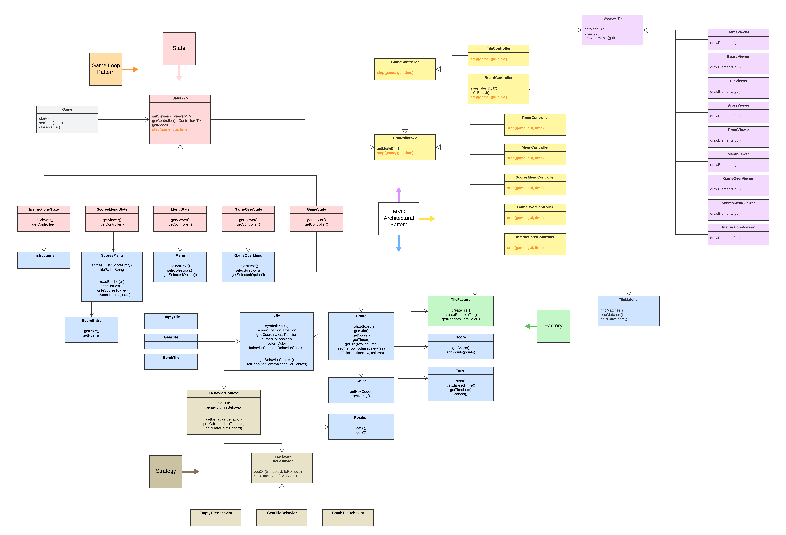
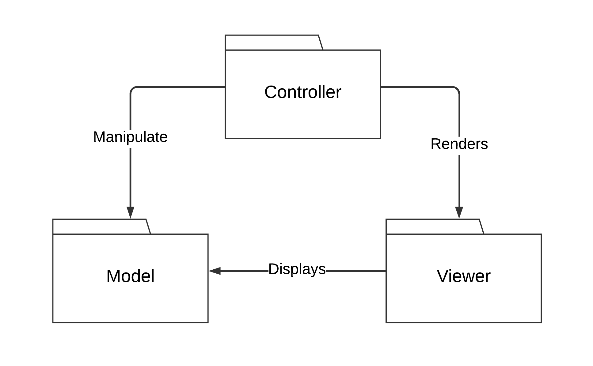
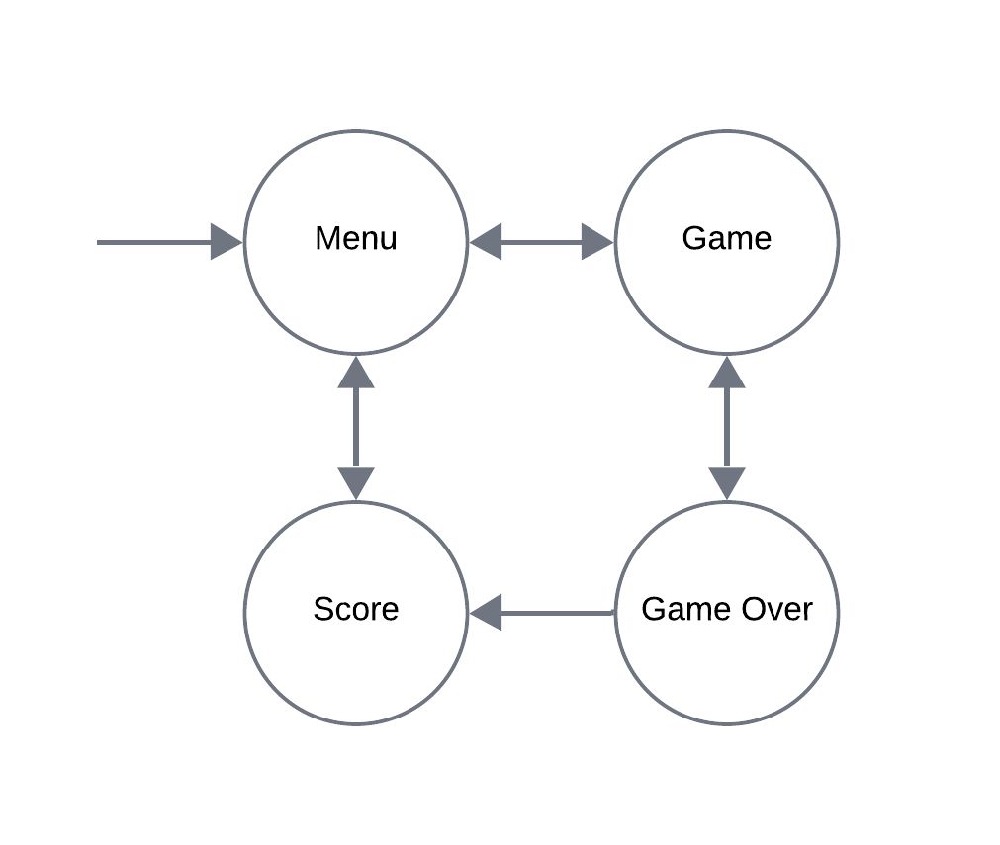
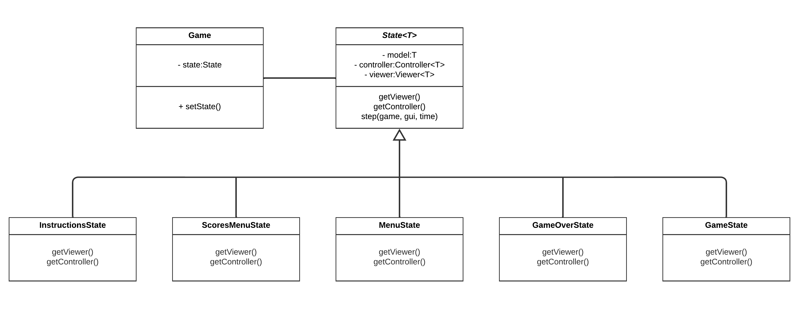
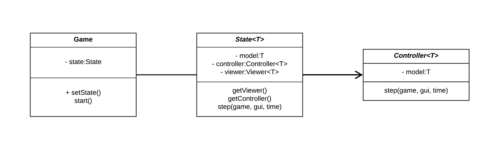
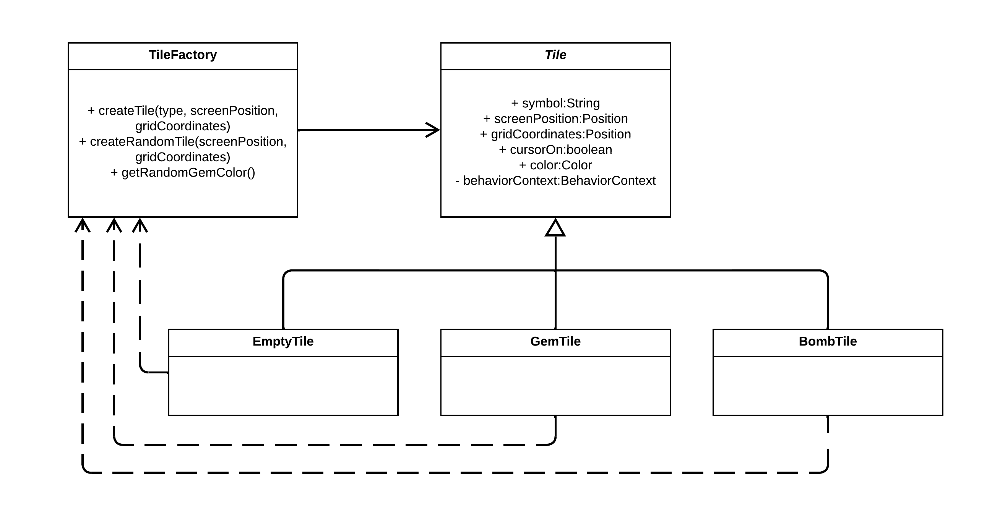
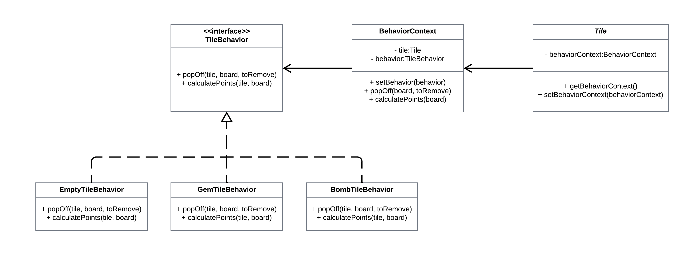
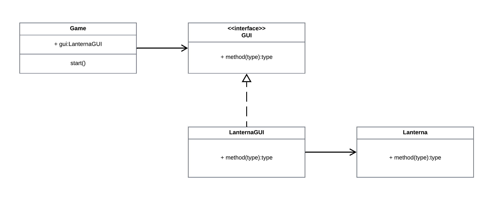
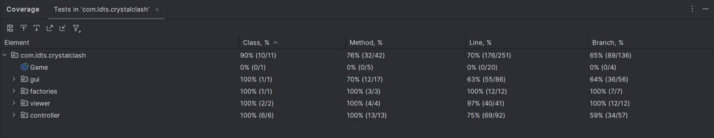
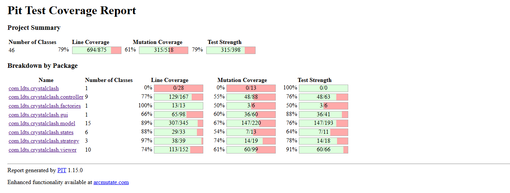

# LDTS_T07_G05 - CRYSTAL CLASH
## Game Description 

Crystal Clash is a captivating puzzle game where every swap matters! Immerse yourself in fast-paced gameplay as you strategically match gems to make dazzling combos. Race against the clock and test your skills to achieve the highest score possible in this exhilarating challenge!

This project was developed by **Ana Margarida Ribeiro** ([up202305264@fe.up.pt](mailto:up202305264@fe.up.pt)), **André Siqueira** ([up202300449@fe.up.pt](mailto:up202300449@fe.up.pt)) and **Henrique Perry** ([up202306582@fe.up.pt](mailto:up202306582@fe.up.pt)) as part of the **Software Design and Testing Laboratory** curricular unit at **Faculty of Engineering of University of Porto**.

## 🛠️ Technologies Used

- **Java:** Core programming language for game logic and mechanics.
- **Lanterna:** Lightweight library for creating terminal-based games.
- **JUnit:** For unit testing to ensure code reliability and functionality.

## 🚀 Implemented Features

- [x] **Randomized board** - Each game begins with a unique, randomized arrangement of tiles, ensuring a fresh and unpredictable experience every time you play.
- [x] **Tile movement** - Navigate effortlessly across the board in all directions using intuitive keyboard controls, while staying within the board's boundaries.
- [x] **Tile swapping** - The player has the capability of swapping adjacent tiles to create exciting combinations and set up strategic plays.
- [x] **Match detection** - Automatic identification of matches with three or more tiles in a row or column.
- [x] **Tile popping** - Matches are cleared from the board, making space for new tiles to fall into place.
- [x] **Gravity-powered tile shifting** - Tiles cascade downward to fill empty spaces, creating opportunity for chain reactions.
- [x] **Time-based gameplay** - A timer adds urgency, challenging players to score as many points as possible within the time limit.
- [x] **High score system** - Tracks the player’s best score, encouraging replayability and competition.
- [x] **Bombs** - Special tiles that clear surrounding tiles when matched, allowing for strategic moves and massive combos.
- [x] **Dynamic scoring system** - Reward players for creating larger matches and performing combo moves, with bonus points for speed and precision.
- [x] **Menus** - Easy-to-navigate menus for starting the game, viewing high scores, and accessing instructions.

## 🚀 Planned Features

All the planned features were successfully implemented.

## 🧩 Design

### 🔧 Architecture

#### Problem in Context:

The challenge in our project was ensuring a clear separation between the game’s data, logic, and user interface. As the game involves complex interactions between the game state, player inputs, and visual feedback, managing all these aspects within a single monolithic class would quickly lead to tangled, difficult-to-maintain code. The primary concern was to design a system where changes in the UI would not interfere with the underlying game logic or data, and vice versa. We needed an architecture that could scale as we added more features and ensured modularity across the game's various components.
#### The Pattern:

The **Model-View-Controller** (MVC) architectural pattern to handle the separation of concerns between data, logic, and presentation.

#### Implementation:

The implementation includes classes dedicated to specific roles:
- Model: Stores and manages data.
- Controller: Contains the logic that governs the game.
- Viewer: Responsible for rendering visual elements.

These classes interact as shown below:

  

  <b><i>Fig 1. Model, Controller and View architecture</i></b>

#### Consequences:

The benefits of this design include:
- Explicit representation of game states through distinct classes.
- Adherence to the **Single Responsibility Principle (SRP)**.
- Enhanced extensibility for adding new features during development.

### 🔧 State Pattern

#### Problem in Context:

The game involves multiple distinct states such as different menus and gameplay, each with its own set of behaviors and interactions. Without a clear structure to handle these state transitions, the game would quickly become difficult to manage, especially as new states were introduced. The primary challenge was to ensure smooth transitions between these states based on player actions while keeping the game logic clean and maintainable. A naive approach of using conditional checks throughout the code for state management would not only be error-prone but also difficult to extend or modify as the game evolved.

  

  <b><i>Fig 2. Game's state diagram</i></b>

#### The Pattern:

We implemented the **State Pattern**, a behavioral design pattern that enables an object to change its behavior dynamically based on its internal state.

#### Implementation:

The **Game** class acts as the context that manages the current state of the game. It delegates behavior to the active state object. The **State** abstract class defines the shared structure and behaviors for all game states, including methods such as `getViewer()`, `getController()`, and `step(game, gui, time)` — used as part of the game loop implementation. Subclasses such as **MenuState** and **GameState** extend **State** and provide their specific implementations of the defined methods. Each state encapsulates its own logic, separating concerns and making the codebase more modular and extensible.

  

  <b><i>Fig 3. State design</i></b>

#### Consequences:

- Adding or modifying game states is straightforward and does not require changes to unrelated parts of the code.
- Each state encapsulates its behavior, avoiding clutter and promoting clean separation of concerns, which aligns with the **Single Responsibility Principle (SRP)**.
- Game states are explicitly represented, making the code easier to understand and maintain.

### 🔧 Game Loop Pattern

#### Problem in Context:

A game requires a continuous cycle of receiving user inputs, processing game logic, and rendering visuals. Without a structured approach to manage this cycle, it could lead to performance issues, inconsistency in user input processing, or even a broken user experience. Achieving this efficiently without unnecessary delays or complexity was a critical design challenge.

#### The Pattern:

We implemented the **Game Loop Pattern**, which ensures a consistent and smooth flow of operations by repeating the following steps:
1. Process inputs.
2. Update game state.
3. Render outputs.

#### Implementation:

The main game loop resides in the **Game** class and iterates over the above steps with the `step(game, gui, time)` method. The loop also maintains a timer to regulate the frame rate and ensure time-based gameplay. Each state (menu, gameplay, etc.) provides specific implementations for input handling and updates, enabling a modular approach. Additionally, the Game Loop interacts seamlessly with the State Pattern, as the active state defines specific input handling, logic updates, and rendering behavior, making the loop adaptable and modular.

  

  <b><i>Fig 4. Game loop design</i></b>

#### Consequences:

The game loop pattern provides:
- Consistency in game execution, regardless of the player's input speed.
- A clear separation of concerns for input processing, logic updates, and rendering.
- Flexibility to add new states or features without altering the loop structure.

### 🔧 Factory Design Pattern

#### Problem in Context:

The game features a variety of tiles, each with its own properties, behaviors, and visual representations (e.g., gems, bombs, empty tiles). If the creation of these tiles were handled directly within the core game logic, it would lead to tight coupling between the game’s mechanics and the tile instantiation process. This would result in repeated code, difficulty in adding new tile types, and reduced scalability. The problem was to manage tile creation in a way that decouples it from the rest of the game logic while maintaining flexibility to add new types of tiles with distinct behaviors in the future.

#### The Pattern:

To address this, we implemented a **Factory** design pattern, specifically a **Simple Factory**. It is a creational design pattern that centralizes object creation in a dedicated class. This approach decouples the instantiation of objects, such as tiles, from the main game logic, improving code modularity and scalability.

#### Implementation:

The **TileFactory** class handles the creation of tile instances, centralizing the logic for instantiating different tile types. It provides methods such as `createTile(type, screenPosition, gridCoordinates)`, which returns a specific tile based on the provided parameters, and `getRandomGemTile()`, which has a predefined probability of creating a **BombTile**. By using the Factory pattern, the class abstracts the tile creation process, effectively decoupling it from the main game flow and promoting greater modularity and maintainability.

  

  <b><i>Fig 5. Factory design</i></b>

These classes can be found in the following files:
- [TileFactory](../src/main/java/com/ldts/crystalclash/factories/TileFactory.java)
- [Tile](../src/main/java/com/ldts/crystalclash/model/Tile.java)
- [GemTile](../src/main/java/com/ldts/crystalclash/model/GemTile.java)
- [EmptyTile](../src/main/java/com/ldts/crystalclash/model/EmptyTile.java)
- [BombTile](../src/main/java/com/ldts/crystalclash/model/BombTile.java)

#### Consequences:

This pattern offers:
- Loose coupling between the game logic and tile creation.
- Flexibility in object creation without directly exposing this logic to clients.
- Adherence to the **Open/Closed Principle**. It allows for easier extensions of object creation logic without modifying the existing client code.

### 🔧 Strategy Design Pattern

#### Problem in Context:

Each tile in the game needs to exhibit different behaviors depending on its type. For example, some tiles pop when matched, while others might trigger special effects or score points based on specific conditions. Embedding all these behaviors directly into the Tile class would not only make the class bloated and difficult to maintain, but it would also violate the **Single Responsibility Principle (SRP)**. Additionally, adding new behaviors or changing existing ones would require modifying the Tile class itself, leading to rigid and error-prone code. The challenge was to allow tiles to have different behaviors dynamically, without overloading the Tile class or making the system inflexible.

#### The Pattern:

We utilized the **Strategy Pattern**, a behavioral design pattern that enables selecting an algorithm's behavior at runtime.

#### Implementation:

The **Tile** class maintains a reference to a **BehaviorContext** object, which acts as a mediator between the tile and its behavior. The **BehaviorContext** holds a **TileBehavior** interface, which defines the contract for behaviors such as `popOff(tile, board, toRemove)` and `calculatePoints(tile, board)`. Concrete implementations of this interface — **EmptyTileBehavior**, **GemTileBehavior**, and **BombTileBehavior** — provide the specific behavior logic for each type of tile.

When a tile is created, its behavior is set via the **BehaviorContext** using the `setBehavior()` method.

  

  <b><i>Fig 6. Strategy design</i></b>

These classes can be found in the following files:
- [TileBehavior](../src/main/java/com/ldts/crystalclash/strategy/TileBehavior.java)
- [GemTileBehavior](../src/main/java/com/ldts/crystalclash/strategy/GemTileBehavior.java)
- [EmptyTileBehavior](../src/main/java/com/ldts/crystalclash/strategy/EmptyTileBehavior.java)
- [BombTileBehavior](../src/main/java/com/ldts/crystalclash/strategy/BombTileBehavior.java)
- [BehaviorContext](../src/main/java/com/ldts/crystalclash/strategy/BehaviorContext.java)
- [Tile](../src/main/java/com/ldts/crystalclash/model/Tile.java)

#### Consequences:

This design provides:
- Clear separation of behavior logic from tile data.
- Flexibility to introduce new behaviors without altering the Tile class.
- Improved maintainability by adhering to the **Open/Closed Principle (OCP)**.

### 🔧 Facade Design Pattern

#### Problem in Context:

Our game uses the Lanterna library to handle GUI operations, but the library is complex and exposes many functions that are irrelevant to our specific needs. Furthermore, the library’s structure does not entirely align with the architecture of our game, which could lead to violations of design principles like the **Interface Segregation Principle (ISP)**. A direct dependency on the library would also violate the **Dependency Inversion Principle (DIP)**, as the high-level game logic would be tightly coupled to a low-level module. The challenge was to isolate the game from the complexities of the Lanterna library while still retaining the necessary functionality, making it easier to replace or extend the GUI subsystem in the future.
#### The Pattern:

We implemented the Facade Pattern, which provides a simplified interface to the Lanterna subsystem, exposing only the essential functionalities required by the game.

#### Implementation:

The **LanternaGUI** class acts as a facade, providing a streamlined interface to the library by exposing only the functionality necessary for the game. The game logic interacts exclusively with **LanternaGUI**, avoiding direct dependencies on the library's complex low-level details. This abstraction isolates the game logic from the GUI implementation, making it easier to replace or extend the GUI subsystem in the future.

  

  <b><i>Fig 7. Facade design</i></b>

These classes can be found in the following files:
- [Game](../src/main/java/com/ldts/crystalclash/Game.java)
- [GUI](../src/main/java/com/ldts/crystalclash/gui/GUI.java)
- [LanternaGUI](../src/main/java/com/ldts/crystalclash/gui/LanternaGUI.java)

#### Consequences:

The benefits include:
- Isolation of game logic from the complexity of the GUI library.
- Enhanced testability and modularity.
- Ability to replace or extend GUI functionality without affecting the core game logic.

## 🔍 Code smells

We have used the **errorprone** plugin, and we have made changes to our code based on the given warnings. Still, some warnings are still present because we have decided it was not worth it to change our code based on those, and we justify it below.

\main\java\com\ldts\crystalclash\model\Position.java:31: 

warning: [EqualsGetClass] Prefer instanceof to getClass when implementing Object#equals.

**Justification:** The current implementation is already functional and meets the project requirements.

src\main\java\com\ldts\crystalclash\model\Music.java:39: 

warning: [CatchAndPrintStackTrace] Logging or rethrowing exceptions should usually be preferred to catching and calling printStackTrace

**Justification:** The printStackTrace method provides sufficient debugging information for this context; the exception does not impact critical system functionality.

src\main\java\com\ldts\crystalclash\model\ScoresMenu.java:29: 

warning: [JavaUtilDate] Date has a bad API that leads to bugs; prefer java.time.Instant or LocalDate.

**Justification:** The use of java.util.Date in this context is minimal and encapsulated within a single format operation. Changing it to java.time classes would require updating related dependencies and test cases.

src\main\java\com\ldts\crystalclash\model\ScoresMenu.java:20: 

warning: [DefaultCharset] Implicit use of the platform default charset, which can result in differing behaviour between JVM executions or incorrect behavior if the encoding of the data source doesn't match expectations.

**Justification:** The project does not target multiple platforms with varying default charsets, and it is expected to run in a controlled environment where the default charset is consistent and sufficient.

None of these warnings currently impact the correctness or performance of the application in a meaningful way.

## 📊 Test coverage

  

  <b><i>Fig 8. Test coverage</i></b>

## 🛡️ Mutation testing

  

  <b><i>Fig 8. Mutation testing</i></b>

For the mutation testing report, click [here](./pitest/index.html).

## ✍️ Self-evaluation

Work distribution between the group members:

- **Ana Margarida Ribeiro**: 33,3%
- **André Siqueira**: 33,3%
- **Henrique Perry**: 33,3%

